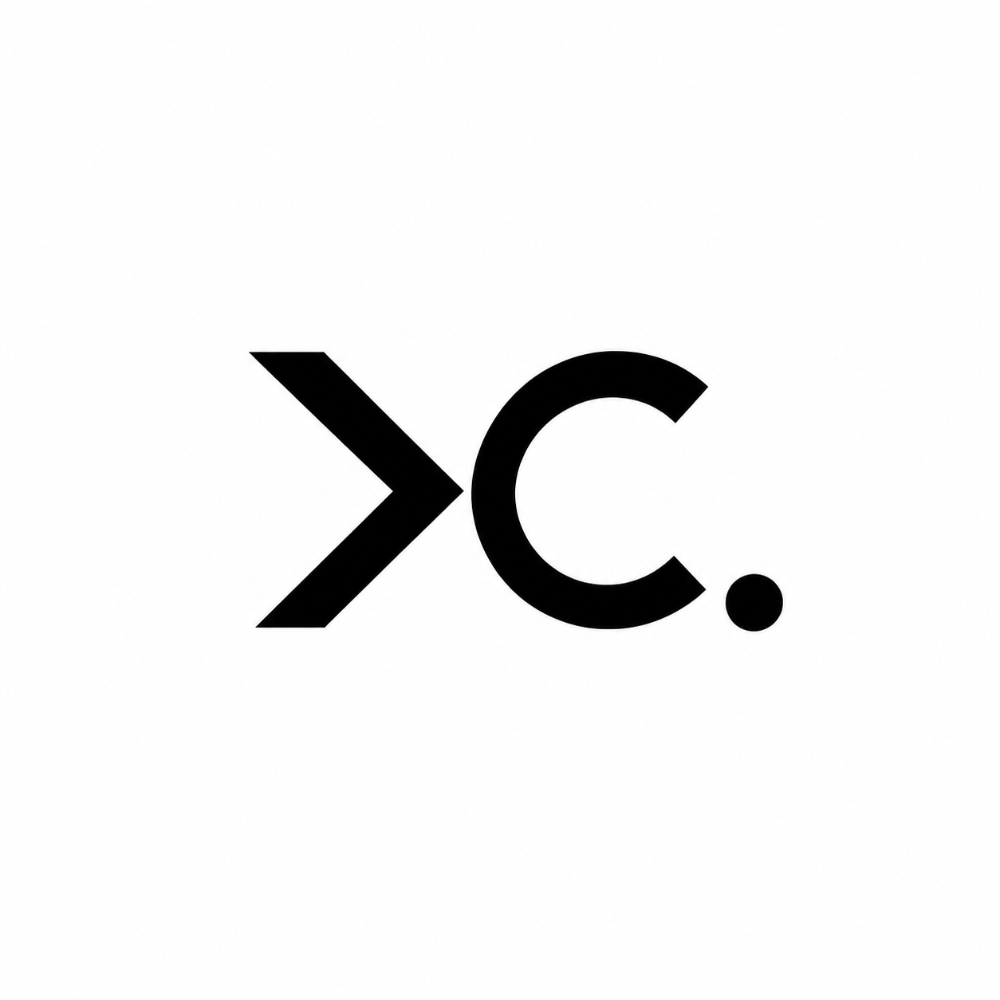

# xCaptaiN09

**Brand Assets**

Official visual identity — logos, vectors, renders, and motion assets for Muhammed Dilshad A (@xCaptaiN09).

---

## Gallery

  
  
  

## Contents

| Folder        | Contents                                                         |
| ------------- | ---------------------------------------------------------------- |
| `vectors/`    | SVG source files, banner PDF                                     |
| `renders/`    | PNG exports — transparent, black bg, white bg, squircle variants |
| `animations/` | Logo motion MP4s                                                 |

## Usage & Legal

All visual marks, vectors, renders, and media in this repository are proprietary to **Muhammed Dilshad A (xCaptaiN09)**.

No part of this repository may be reproduced, distributed, modified, or used — commercially or non-commercially — without prior written permission.

Unauthorized use may constitute trademark and/or copyright infringement. See [LICENSE](LICENSE).

---

© 2026 Muhammed Dilshad A (xCaptaiN09). All Rights Reserved.

